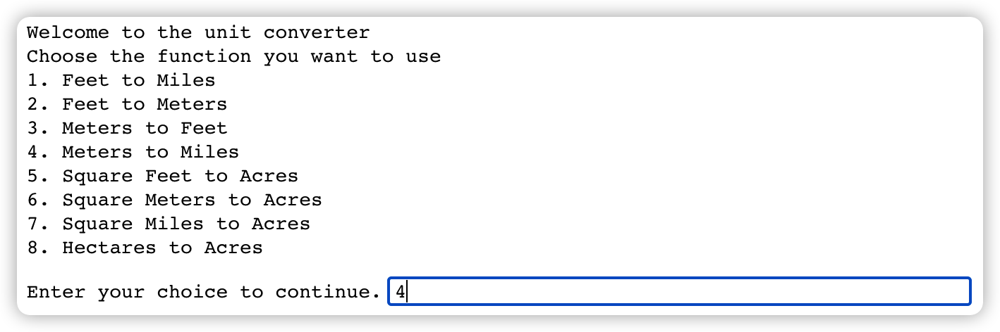
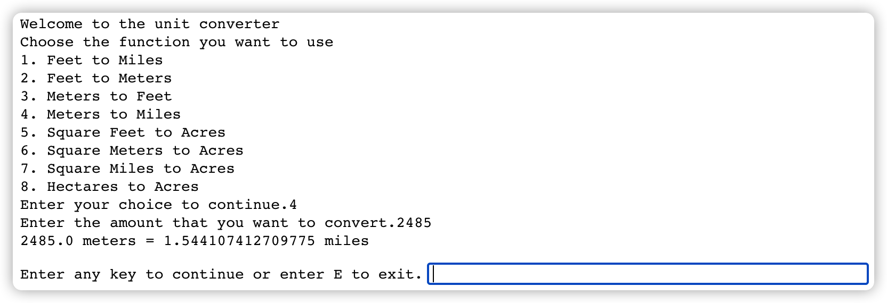

# Homework 4

Write a unit converter program that can convert any amount from input units to output units as follows:

1. Feet to Miles,
2. Feet to Meters,
3. Meters to Feet,
4. Meters to Miles,
5. Square Feet to Acres,
6. Square Meters to Acres,
7. Square Miles to Acres, and
8. Hectares to Acres.

## Program Structure:

Two scripts are required: the main script (`.ipynb` file) and a module script (`.py` file).

The module script should contain **8** functions, one for each of the conversions above. e.g., the function to convert feet to miles could be called `feet2miles`.
It should take one numeric parameter (assumed to be the amount in feet) and should return the corresponding amount converted to miles. e.g., if we pass **5280** to the `feet2miles` function, it should return **1**.

When the main script runs, it should prompt the user to enter a numeric amount in the interactive window, as below.

1. Make sure that the amount entered is a **positive** <u>valid number</u>, which can be either an integer or floating-point number.
2. Once the number is entered and validated, prompt the user with a list of conversion options (see below).
3. Check to make sure that the user chose one of the numbers between 1 and 8 (since 8 conversions are offered).
4. Any other character should not be accepted, and the user should be asked to try again and enter a valid number between 1 and 8.

Once the conversion option is chosen, you should display the results as follows: `xx input_unit = yy` output_unit e.g. `5280 Feet = 1 Mile` or `1 Square Mile = 640 Acres`.

Last, prompt the user if they would like to **continue or not**.
If they choose to continue, prompt them again to enter a numeric value.
This should continue until the user chooses to stop.

## Error Handling:

Make sure anticipate input errors e.g., if a user enters an amount that’s not a valid number e.g. **80a2g** or negative value **-50**.

Additionally, include the use of `try-except` clause to capture unexpected errors and `print` the error messages on the screen similar to cases we have shown in class.

**Note**: If Python is not finding the functions in your module, try to close python and open it again.

**Data**: No data are required or used for this homework.

**Turn In**: (pay attention to the naming convention)

1. a Python Notebook, Name the file as following `<LASTNAME>_HW4.ipynb` e.g., `CHEN_HW4.ipynb`.
2. python file (`CHEN_ucon.py`), and
3. a presentation recording (`CHEN_HW4.mp4`)

**Evaluation**: The instructor will review the contents and test the scripts.

## REQUIRED INDIVIDUAL WORK

Homework must be individual. Students are allowed to discuss ideas; however, the implementation of the solution should be individual. Please follow the honesty standards as defined by the University of Florida Honor Code. See syllabus for more information.

## PENALTY FOR LATE SUBMISSION
See syllabus
